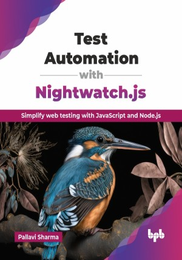

# Test Automation with Nightwatch.js

Simplify web testing with JavaScript and Node.js.

This is the repository for [Test Automation with Nightwatch.js
](https://bpbonline.com/products/modern-communication-with-social-media-2?variant=44665447153864),published by BPB Publications.

## About the Book
Given the fast-paced and dynamic nature of today’s web development landscape, test automation is essential for maintaining quality across dynamic applications. Nightwatch.js stands as a powerful yet accessible end-to-end testing framework that elegantly bridges the gap between testing complexity and implementing simplicity, making automated quality assurance achievable for developers at all skill levels.

This book guides readers through the complete Nightwatch.js journey, beginning with fundamental concepts and practical setup in Visual Studio Code. Early chapters establish a solid foundation in element identification strategies and web interactions, before addressing critical challenges of synchronization in modern applications. The middle sections explore practical testing techniques through assertions. The book covers handling complex HTML elements, such as forms, tables, dropdowns, and new windows, before moving on to advanced topics, including browser logs, performance monitoring, network requests, screenshots, and intricate keyboard and mouse actions. These are all structured within the Page Object Model pattern for maintainability. The final sections focus on professional-grade implementation aspects, including data management with Excel and CSV integration, logging systems, and execution in cloud environments like BrowserStack for cross-browser verification.

By the end of this book, readers will be highly competent in building reliable, maintainable, and scalable test automation suites with Nightwatch.js. They will develop practical skills in JavaScript-based automation, gain understanding of testing best practices, and acquire expertise to implement scalable frameworks, enhancing development workflows and delivering higher-quality software products.

## What You Will Learn
• Nightwatch.js fundamentals and integration with Visual Studio Code for effective test setup.

• Diverse interactions with web elements using Nightwatch.js's command interface.

• Run Nightwatch.js tests on BrowserStack; integrate with GitHub Actions.

• Implement testing approaches using assertions and complex element handling.

• Web element identification and interaction strategies, and synchronization techniques.
